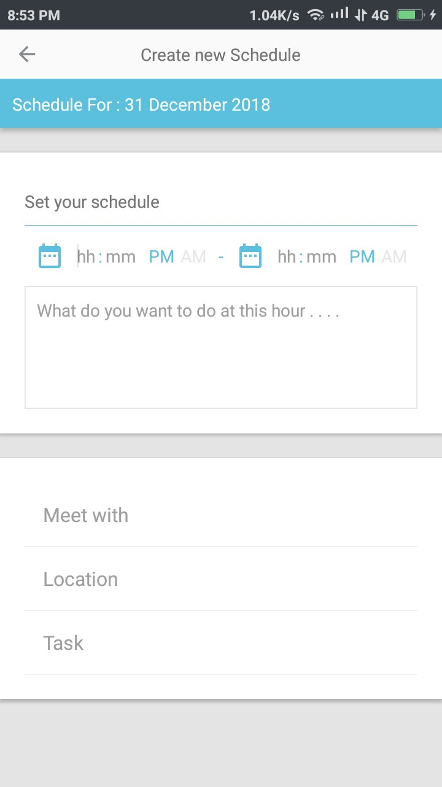
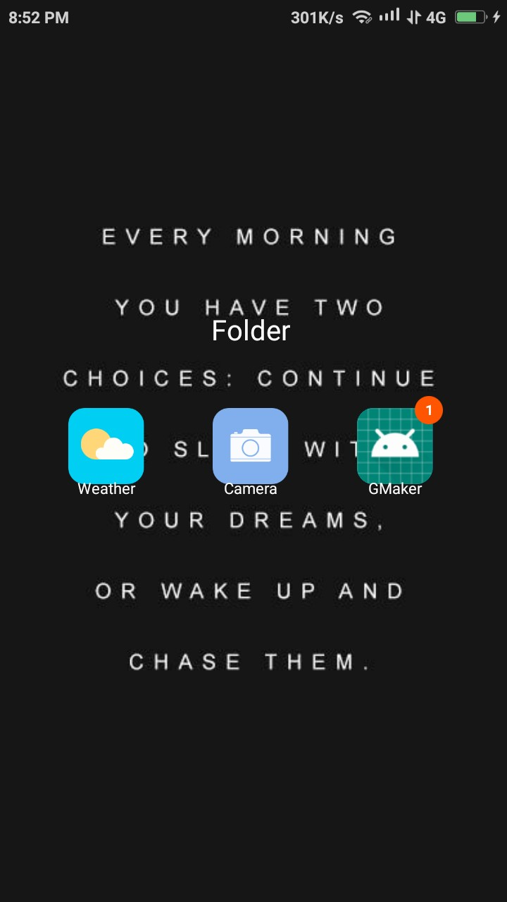
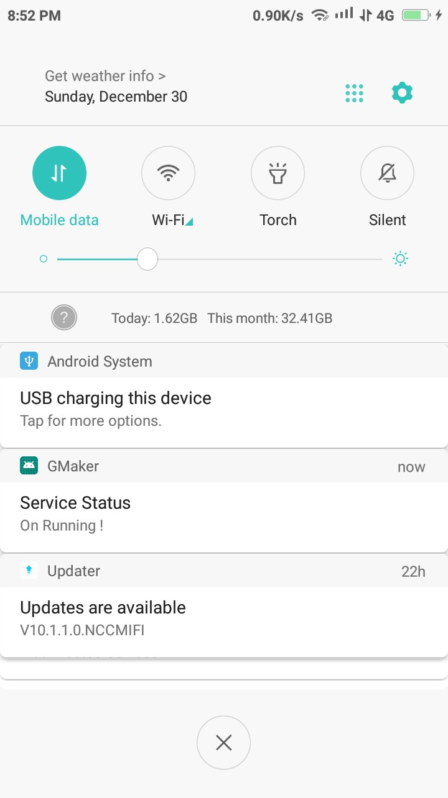
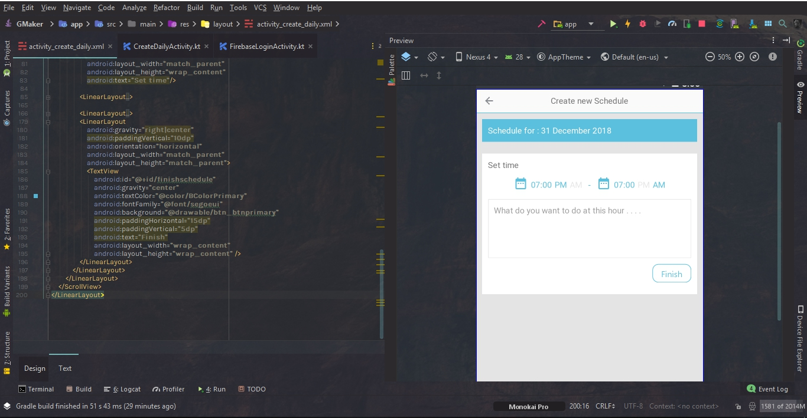

# GMaker

<h2> Status program : sudah dapat digunakan namun ceritanya masih <i>early-access</i></h2>

<h6>
<b>highlight</b> 
<a href="https://github.com/Thibobs/GMaker/tree/master/app/src/main/java/later/corporation/adliraihan/gmaker">Mysql Source Code</a> 
<a href="https://github.com/Thibobs/GMaker/tree/master/app/src/main/java/later/corporation/adliraihan/gmaker/firebase">Firebase source Code</a> 
<a href="https://github.com/Thibobs/GMaker/tree/master/app/src/main/java/later/corporation/adliraihan/gmaker/adapter">adapter</a> 
<b>Algorithm Logic</b> made by me 
<a href="https://github.com/Thibobs/GMaker/blob/master/app/src/main/java/later/corporation/adliraihan/gmaker/firebase/CreateDailyFunctionTimer.kt">Daily Timer Validation</a> 
<a href="https://github.com/Thibobs/GMaker/blob/master/app/src/main/java/later/corporation/adliraihan/gmaker/firebase/FirebaseCalendar.kt">Calendar picker & Time difference Algorithm</a> 
<a href="https://github.com/Thibobs/GMaker/blob/master/app/src/main/java/later/corporation/adliraihan/gmaker/firebase/FirebaseCalendar.kt">Background services for reminding ongoing schedule</a> 
  <b>Features</b> 
  - Almost all activity are userfriendly , ada beberapa fitur yg mempermudah user dalam menggunakan app ini 
  - Reminder 
  - Realtime database's 
  - etc 
</h6>  
<table>
  <tr>
    <td colspan="3">NEW UPDATE</td>
  </tr>
  <tr>
    <td>Final schedule Design</td>
    <td>Notification</td>
    <td>Using Background services</td>
  </tr>
  
  <tr>
  <td></td>
  <td></td>
  <td></td>
  </tr>
  
  <tr>
    <td>Update ini sudah termasuk implementasi schedule terhadap database <i>untuk nonpremium user max schedule dibatasi hingga 3 schedule , sedangkan premium dapat membuat schedule sampai 10</td>
  <td>implementasi notification | <b>next update</b> : mengimplementasikannya dengan coding , yaitu ongoing schedule/agenda</td>
  <td>Implementasi background services .</td>
  </tr>
  </table>

<table>
  <tr>
    <td><s>Next Update is in progress</s> <b>Sudah di implementasikan pada update yang baru</b></td>
  </tr>
  <tr>
    <td></td>
  </tr>
  <tr>
    <td>
      Penjelasan Update : 
      Menambah fitur Scheduling dengan pancuan waktu (dari) dan (sampai) , 
      contoh :  
         1. 08:00 AM - 09:00 AM | Membeli Ayam  
         2. 09:00 AM - 10:00 PM | Bekerja  
         3. etc 
      Meskipun form hanya satu , tetapi bila user menambahkan schedule time pada tanggal dan bulan serta tahun yang sama
      maka system akan melakukan appending . Tetapi apabila waktu yang di tentukan telah lewat maka schedule tersebut
      akan dihapus oleh system .  
        
      Masukan / saran bisa menghubungi  saya melalui email. 
    </td>
  </tr>
</table>

<i><b>Seluruh image yang terdapat pada applikasi ini seluruhnya dari unsplash.com</b></i>
 
Bila anda penasaran proses pembuatan secara menyeluruh bisa di cek di IG saya <a href="https://www.instagram.com/adli.raihan/">disini</a>
dari mulai pertama pembuatan sampai akhir serta beberapa design yang di rancang ulang / diubah . Rencananya app ini pula akan diijadikan opensource <i> well it is lol </i>
  

<b>Future update</b> :
- <b>Diary update </b> , setelah schedule dilakukan / seperti mengirim kesan dan pesan setelah schedule tersebut di lakukan.
- <s><b>Schedule update</b> perjam notification akan muncul setiap jam 10 malam (<i>secara default</i>) sebagai reminder untuk mengisi schedule esok hari.</s> <i>sudah terimplementasi</i>
  

<table>
  <tr>
    <td colspan="2">form membuat agenda</td>
  </tr>
  <tr>
    <td></td>
    <td></td>
  </tr>
</table>

<i>seluruh image dapat dilihat  <a href="https://github.com/Thibobs/GMaker/tree/master/aplikasi_image">disini</a>

Developingnya sampai saat ini baru 20% dan pengerjaan baru 2 minggu saja karena terpotong dengan jadwal kuliah serta asisten dosen.
email saya adliraihan002@gmail.com
