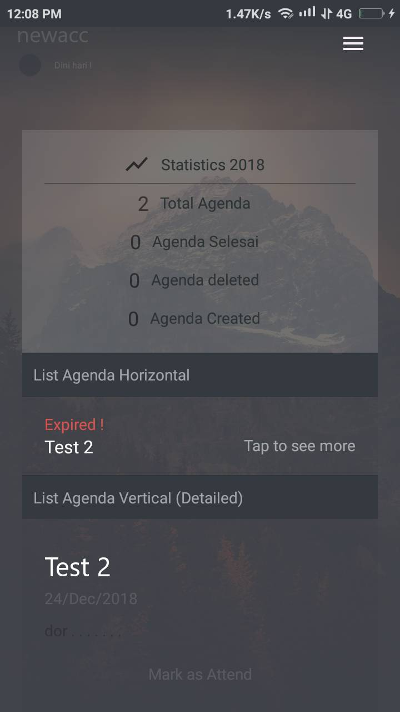
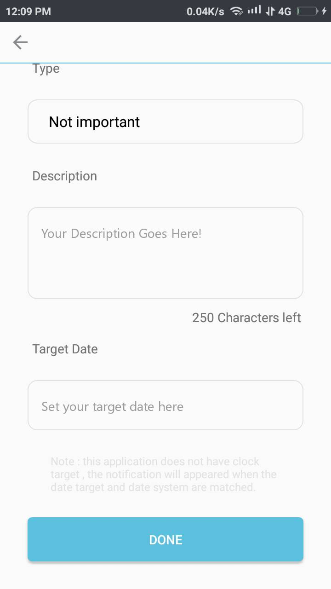
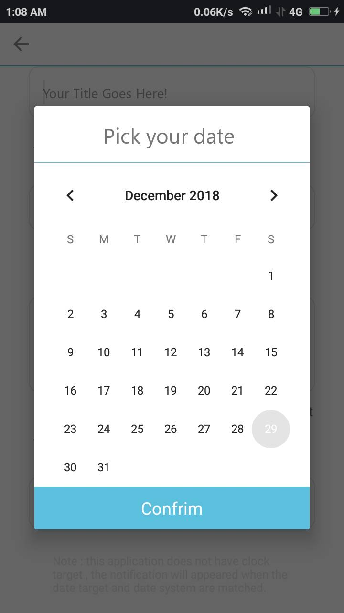

# GMaker
<i>Seluruh image yang terdapat pada applikasi ini seluruhnya dari unsplash.com</i>

GM adalah genda maker , 
latar belakang pembuatan web ini adalah karena saya hobi sekali yang namanya mengatur waktu , dari pagi sampe malem itu biasanya
saya sudah menulis terlebih dahulu apa yang harus dilakukan . Tapi , semuanya itu secara manual alias ditulis di note laptop .

seiring berjalannya waktu , jenis gadget apa yang sering saya gunakan ? yaitu <b>smartphone</b> . Karena alasan tersebut saya ingin
sekali membuat applikasi pengatur waktu . Meskipun sudah banyak di pasaran , namun banyak fitur yang diinginan tidak terdapat pada app tersebut.

Applikasi ini terintegrasi pada dua database :
<ul>
<li>Firebase <i>Used</i></li>
<li>mysql dengan JSON <i>Unused</i></li>
</ul>
<i>saya punya keahlian php , namun saya lebih memilih firebase sebagai tantangan.</i>

Progress sampai saat ini : 
<b>Aplikasi sudah dapat dipakai</b>
 

<b>Kendala</b> :
perubahan keterangan waktu dini hari tidak berubah menjadi sore hari pada 12 PM - 5 PM -> known bug saat ini.

<b>Future update</b> :
- Popup notification bila ada ongoing schedule
- Diary setelah schedule dilakukan / seperti mengirim kesan dan pesan setelah schedule tersebut di lakukan.

<table>
  <tr>
    <td colspan="2">form membuat agenda</td>
  </tr>
  <tr>
    <td></td>
    <td></td>
  </tr>
</table>

<i>seluruh image dapat dilihat  <a href="https://github.com/Thibobs/GMaker/tree/master/aplikasi_image">disini</a>

Developingnya sampai saat ini baru 20% dan pengerjaan baru 2 minggu saja karena terpotong dengan jadwal kuliah serta asisten dosen.
bila kamu berminat dengan app ini bisa hubungi saya di email adliraihan002@gmail.com
