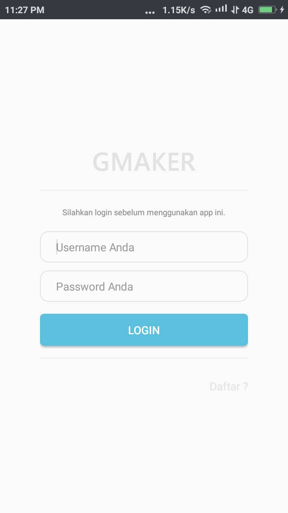
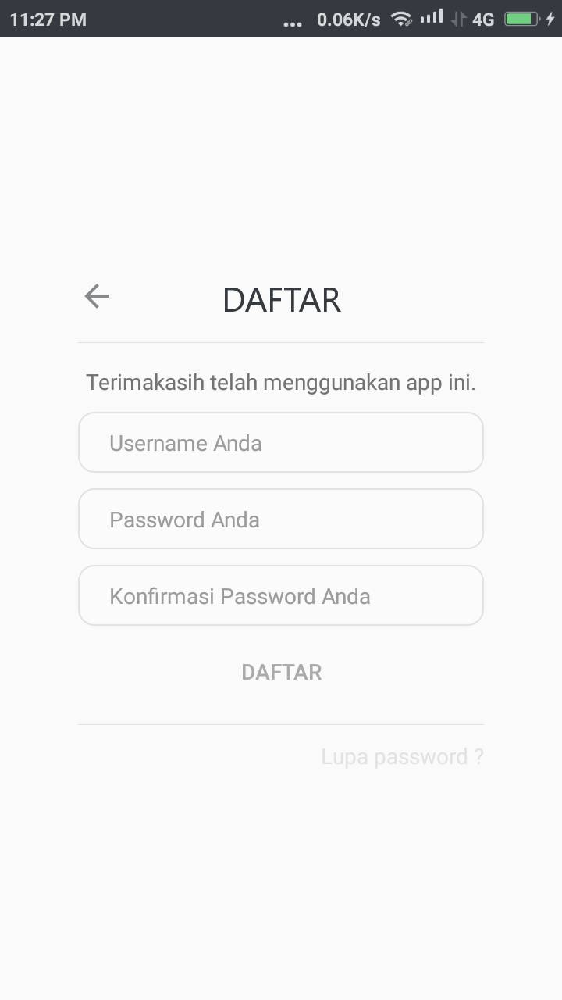
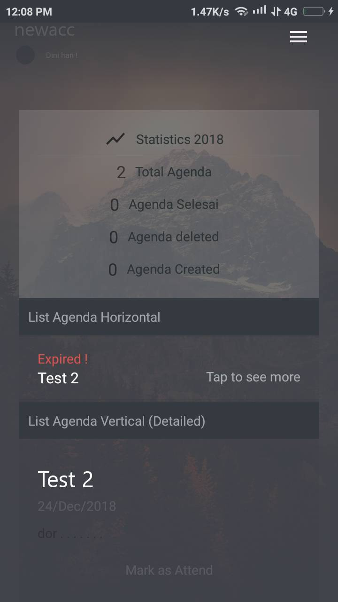

# GMaker
  
    fun CheckConnectivity(Cntx:Context){
        val TAGS_TEST = "TEST RUN"
        (Cntx.getSystemService(Context.CONNECTIVITY_SERVICE) as ConnectivityManager)
                .activeNetworkInfo.apply {
            Toast.makeText(Cntx,StringBuilder().also {
                if((this != null)&&isConnected){
                    toString().let {
                        log -> Log.i(TAGS_TEST,log)
                        it.append("Connectivity")
                    }
                }else if(this == null){
                    toString().let {
                        log -> Log.i(TAGS_TEST,log)
                        it.append("No Connectivity")
                    }
                }
            }, Toast.LENGTH_SHORT).show()
        }
  
  </code>
  
  <i>Note</i> : <s>Kode tersebut belum saya upload karena jujur codingan saya kurang rapih , kemungkinan besar orang awam malas buat baca kodingannya .</s>

<h4>Update Source Code & Apk | 1/5/2019 : 
<a href="https://github.com/Thibobs/GMaker/releases/tag/1.0.1.00">GMaker 1.0.1.00</a></h4>
<i>Older Version</i> 
<a href="https://github.com/Thibobs/GMaker/releases/tag/1.0.0.95">GMaker 1.0.0.95 [ OLD ]</a> 
<i>Pembenahan Desain</i>
<table>
  <tr>
    <td>OLD LOGIN</td>
    <td>NEW LOGIN</td>
    <td>OLD DAFTAR</td>
    <td>NEW DAFTAR</td>
  </tr>
  <tr>
    <td></td>
    <td></td>
    <td></td>
    <td></td>
  </tr>
  <tr>
    <td>OLD LANDING</td>
    <td>NEW LANDING</td>
  </tr>
  <tr>
    <td></td>
    <td></td>
  </tr>
</table>

<i>seluruh image dapat dilihat  <a href="https://github.com/Thibobs/GMaker/tree/master/aplikasi_image">disini</a> 
  jika ada keperluan bisa hubungi saya di email adliraihan002@gmail.com </i>
  
